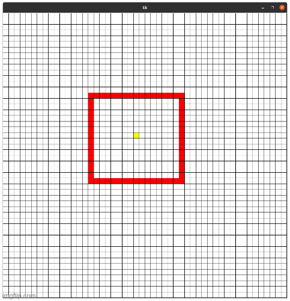

# Pedestrian Sim
A GUI based notebook for visualizing crowd movement simulation based on Cellular Automata Approach

## Define Pedestrians(red) and Single Target(yellow) 
A cell turns from empty state to pedestrian state after left mouse click. Multiple cells state can be toggled by hovering the mouse pressing left mouse button.

## Simulate Crowd movement towards the target 
By repeatedly pressing left mouse button user can visualize pedestrian movement towards the target 

